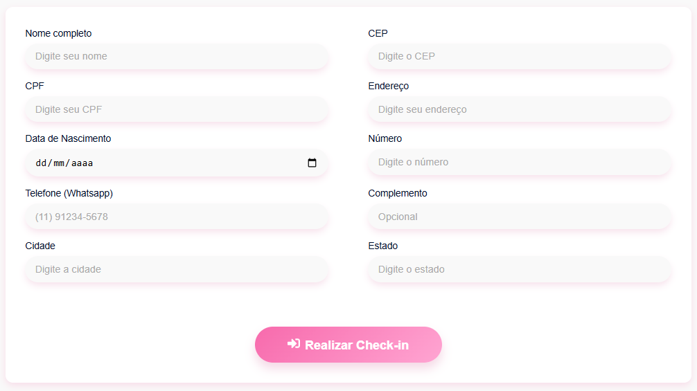

# 🩺 Healz Check-in

**Sistema moderno de check-in para clínicas e hospitais** feito com tecnologias top para garantir agilidade, segurança e controle na ponta dos dedos.

---

## 🚀 Tecnologias Usadas

- **Frontend:** React + Vite + TypeScript  
- **Validação e Forms:** React Hook Form + Zod (validação robusta, nada de gambiarra)  
- **Qualidade de Código:** ESLint + Prettier (padrão cirúrgico, código sempre limpo)  
- **Backend:** Node.js + Express.js (API leve, rápida e eficiente)  
- **Middleware:** CORS + JSON Middleware (proteção e comunicação suave)  
- **Integração:** Google Sheets via API (armazenamento prático e seguro)  
- **Configuração:** dotenv para variáveis de ambiente (seu segredo fica seguro)

---

## ⚙️ Como Rodar o Projeto

> **Atenção:** Este projeto é privado e destinado exclusivamente à equipe autorizada da Healz.  

Se você recebeu acesso ao repositório, siga os passos abaixo para configurar o ambiente local.

### 1. Clone o repositório

> O acesso ao repositório é controlado via plataforma Git (GitHub, GitLab, etc).  
> Solicite seu acesso ao gerente de projeto ou administrador do repositório.

### 2. Instale as dependências do frontend

>npm install

>npm run dev

### 3. Instale as dependências do backend

>cd server

>npm install

> npx tsx main.ts *(para rodar local)*

Renomeie o arquivo .env.example para .env:

> mv .env.example .env

## 🎯 Por que Healz Check-in?
Este projeto foi desenvolvido para uma empresa real, com requisitos rigorosos de segurança, performance e escalabilidade. Não é um protótipo, mas uma solução robusta e confiável, construída com tecnologias modernas como React e Node.js para garantir uma experiência fluida, integração eficiente e manutenção simplificada em ambientes clínicos.

Cada linha de código foi pensada para suportar operações críticas, garantindo agilidade no atendimento e integridade dos dados, refletindo o compromisso da Healz com excelência e inovação no setor de saúde.

A integração com Google Sheets garante que o time clínico tenha dados atualizados em tempo real, sem complicação.

---

## 👥 Nossa Equipe

Aqui quem fez acontecer:

- **Kevinn** – Product Owner & Desenvolvedor Front-end  
- **Devan** – Designer & Desenvolvedor Front-end  
- **Dennis** – Desenvolvedor Backend  
- **Artur** – Desenvolvedor Backend  

## Imagem do formulário

